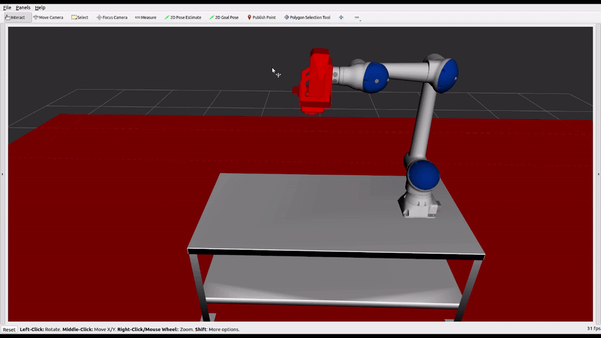
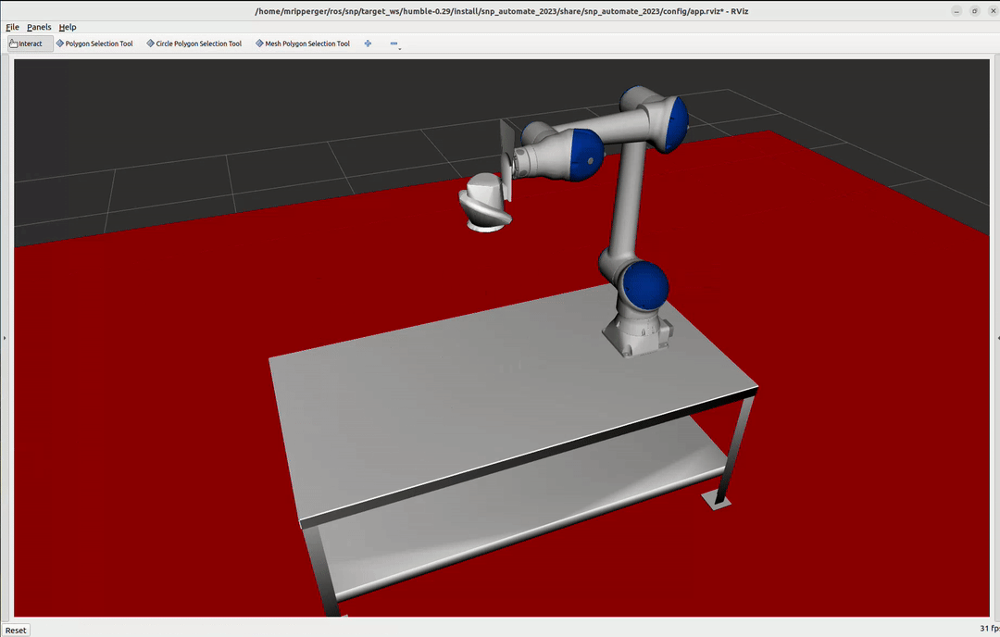

# Rviz Polygon Selection Tool
Rviz tool plugin for creating polygon selections

## Operation

- **Left mouse button click**: Add point to current polygon
- **Middle mouse button click**: Erase current polygon selection
- **Right mouse button click**: Finish current polygon and start new polygon
- **Shortcut `delete`, `backspace`**: Remove all polygons

## Modes
- **Lasso**: click and hold left mouse button while drawing a shape
- **Click**: click and release the left mouse button to drop a vertex in the polygon

Toggle betweeen the modes by selecting the `Lasso mode` check box in the tool properties panel

## Tool Cursor

This tool also provides a customization hook for visualizing a 3D geometry as the cursor.
The cursor tracks the normal vector of the surface over which it hovers.

The `CirclePolygonSelectionTool` visualizes a circle of configurable radius as the cursor.
The `MeshPolygonSelectionTool` visualizes a configurable mesh resource as the cursor.
Use the tool properties panel to configure the appearance of these tools.
